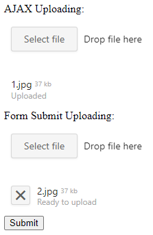

<!-- default badges list -->

<!-- default badges end -->
<!-- default file list -->
# DevExtreme File Uploader - How to upload files in an ASP.NET MVC application.

This example demonstrates how to use the [dxFileUploader](https://js.devexpress.com/Documentation/ApiReference/UI_Components/dxFileUploader/) widget to upload files to a server in an ASP.NET MVC application. 

The example application demonstrates the following techniques:

- Send an AJAX request to upload files.
- Upload files when a user submits an HTML form.

## Files to Review

- [HomeController.cs](./CS/Upload/Controllers/HomeController.cs) (VB: [HomeController.vb](./VB/Upload/Controllers/HomeController.vb))
- [SaveFilesHelper.cs](./CS/Upload/Helpers/SaveFilesHelper.cs) (VB: [SaveFilesHelper.vb](./VB/Upload/Helpers/SaveFilesHelper.vb))
- [Index.cshtml](./CS/Upload/Views/Home/Index.cshtml) (VB: [Index.vbhtml](./VB/Upload/Views/Home/Index.vbhtml))
- [Web.config](./CS/Upload/Web.config) (VB: [Web.config](./VB/Upload/Web.config))

## Documentation

- [DevExtreme File Uploader](https://js.devexpress.com/Documentation/ApiReference/UI_Components/dxFileUploader/)

## More Examples

- [DevExtreme File Uploader - How to upload files to the server in an ASP.NET Web Forms application](https://www.devexpress.com/Support/Center/p/T365088)
<!-- feedback -->
## Does this example address your development requirements/objectives?

 

(you will be redirected to DevExpress.com to submit your response)
<!-- feedback end -->
